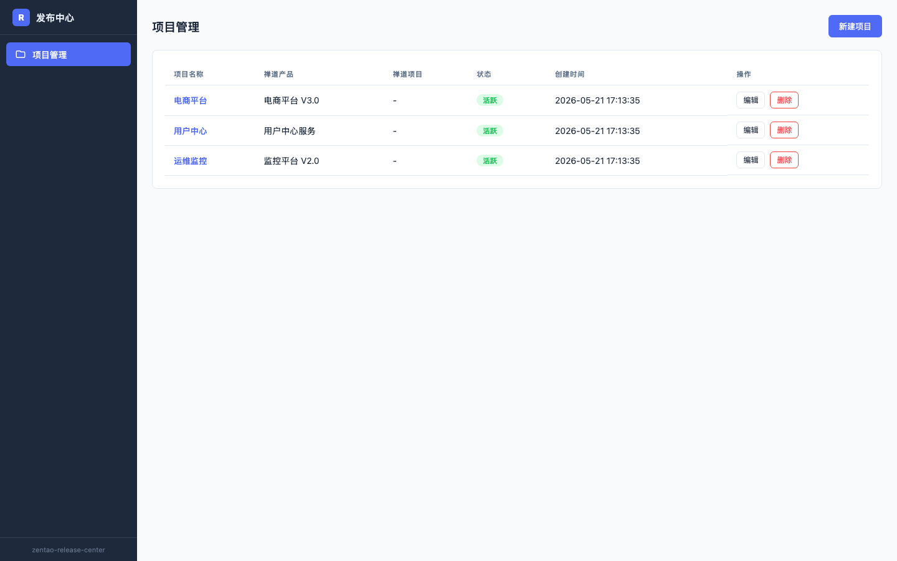
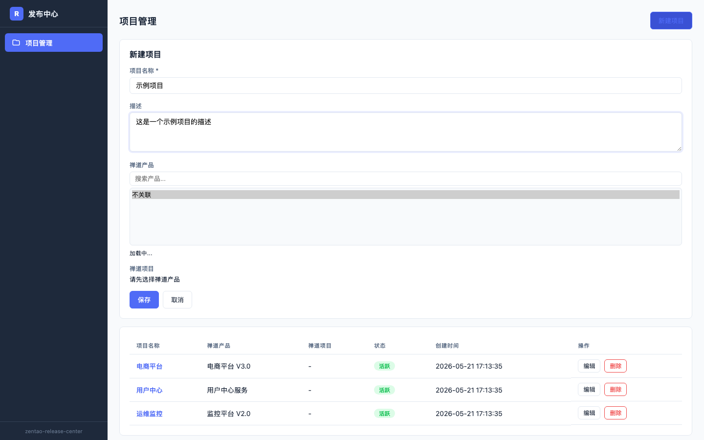
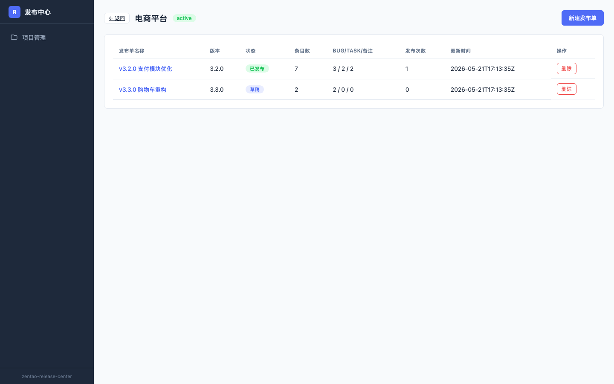
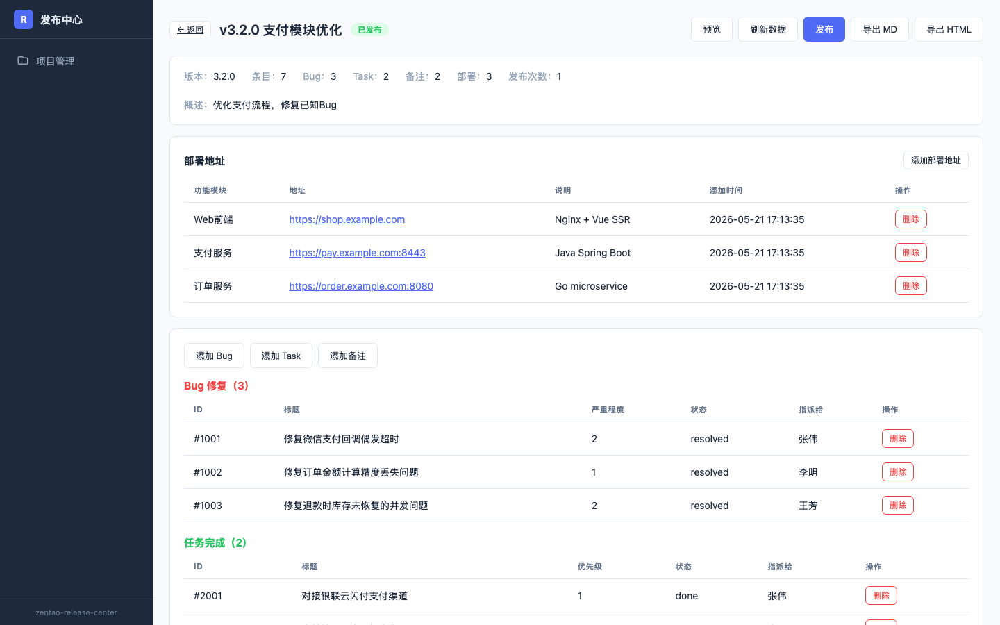

# 禅道发布中心 (zentao-release-center)

基于 [zentao-mini](https://github.com/yi-nology/zentao-mini) 的独立发布单管理系统。通过 HTTP API 对接禅道数据，实现发布单的创建、条目管理、部署地址记录、预览和导出。

## 功能特性

- **项目管理** — 创建项目并关联禅道产品/项目（下拉搜索选择，无需手动填写 ID）
- **发布单管理** — 创建发布单，管理 Bug、Task、备注条目
- **部署地址** — 按功能模块和地址记录部署信息，导出时自动包含
- **禅道数据拉取** — 从禅道选择 Bug/Task 添加到发布单，自动填充禅道链接
- **预览 & 导出** — 实时预览发布单（HTML 渲染），支持导出 Markdown/HTML
- **发布快照** — 每次发布生成快照，可查看历史版本
- **标题可点击** — Bug/Task 标题直接跳转到禅道详情页

## 技术栈

**后端：** Go + [Hertz](https://github.com/cloudwego/hertz) + Thrift IDL + SQLite (pure Go)

**前端：** Vue 3 + TypeScript + Vite

## 截图

### 项目列表



### 新建项目



### 项目详情（发布单列表）



### 发布单详情（部署地址 + Bug/Task + 预览导出）



## 快速开始

### 前置条件

- Go 1.24+
- Node.js 22+
- [zentao-mini](https://github.com/yi-nology/zentao-mini) 已运行（默认端口 12345）

### 启动后端

```bash
# 修改 config.yaml 中的 zentao_base_url 为你的禅道地址
go run .
```

后端默认监听 `:8080`。

### 启动前端

```bash
cd frontend
npm install
npm run dev
```

前端默认监听 `:3000`，通过 Vite proxy 转发 API 到后端。

### 配置说明

`config.yaml`:

```yaml
server:
  port: 8080

zentao_mini:
  base_url: "http://localhost:12345/api"   # zentao-mini API 地址
  timeout: 120
  zentao_base_url: "https://zentao.example.com"

database:
  path: "~/.zentao-release-center/release.db"

log:
  level: info
```

## 项目结构

```
├── main.go                    # 入口，依赖注入
├── config.yaml                # 配置文件
├── idl/
│   └── release_center.thrift  # Thrift IDL（API 定义）
├── biz/
│   ├── handler/               # HTTP handlers
│   ├── model/                 # Thrift 生成模型
│   └── router/                # 路由注册
├── internal/
│   ├── config/                # 配置加载
│   ├── service/               # 业务逻辑
│   ├── store/                 # SQLite 存储
│   └── zentao/                # 禅道 API 客户端
├── pkg/appctx/                # 全局服务实例
└── frontend/
    └── src/
        ├── api/               # API 调用
        ├── views/             # 页面组件
        └── router/            # 前端路由
```

## API 概览

| 方法 | 路径 | 说明 |
|------|------|------|
| GET | `/api/projects` | 项目列表 |
| POST | `/api/projects` | 创建项目 |
| GET | `/api/releases` | 发布单列表 |
| POST | `/api/releases` | 创建发布单 |
| POST | `/api/releases/publish` | 发布（生成快照） |
| GET | `/api/releases/export` | 导出 Markdown/HTML |
| GET | `/api/release-items` | 条目列表 |
| POST | `/api/release-items/batch` | 批量添加条目 |
| GET | `/api/deployments` | 部署地址列表 |
| POST | `/api/deployments` | 添加部署地址 |
| GET | `/api/zentao/products` | 禅道产品列表 |
| GET | `/api/zentao/bugs` | 禅道 Bug 列表 |
| GET | `/api/zentao/tasks` | 禅道 Task 列表 |
| GET | `/api/health` | 健康检查 |

## License

MIT
